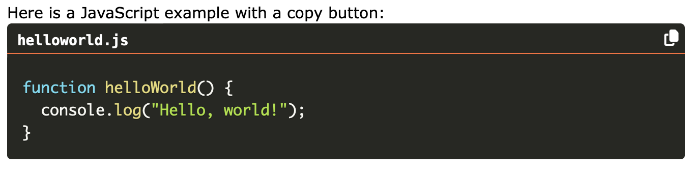

# Add a title and copy button to the Eleventy (11ty) SyntaxHighlighter

The official Eleventy public `@11ty/eleventy-plugin-syntaxhighlight` allows code to be highlighted in markdown content using the Prism JS library for syntax highlighting. 

The following code demonstrates how to add a title bar and copy code button to make it easier to borrow code from the generated website. The code is a wrapper around the Eleventy Syntaxhighlight plugin.

To tryout do the following:

```shellsession
npm install
npm run start
```

Point your browser at https://localhost:8080/



## How it works

The`@11ty/eleventy-plugin-syntaxhighlight` plugin provides the `syntaxHighlight.pairedShortcode(code, lang)` function, which takes a block of code and a specified language. It then returns a syntax-highlighted version of the code. This function can be used within an Eleventy shortcode to easily apply syntax highlighting to code blocks in your templates.

For example, a custom shortcode  can be defined in `eleventy.config.js` as follows:
```
const syntaxHighlight = require("@11ty/eleventy-plugin-syntaxhighlight");

module.exports = function (eleventyConfig) {
  // add Syntax highlighting plugin
	eleventyConfig.addPlugin(syntaxHighlight);

  // add shortcut codeblock
  eleventyConfig.addPairedShortcode("codeblock", function(code, lang, title = "") {
      // generate code highlight
      const highlightedCode = syntaxHighlight.pairedShortcode(code, lang);

      // return code with header and copy button
      return `<div class="code-block-wrapper">
          <div class="code-header">
              <div class="code-title">${title}</div>
              <div>
                  <span class="copy-text">Copied!</span>
                  <button class="copy-btn" onclick="copyCode(this)">
                      <i class="fa-solid fa-copy"></i> <!-- Font Awesome copy icon -->
                  </button>
              </div>
          </div>
          ${highlightedCode}
          </div>`
    });
};
```